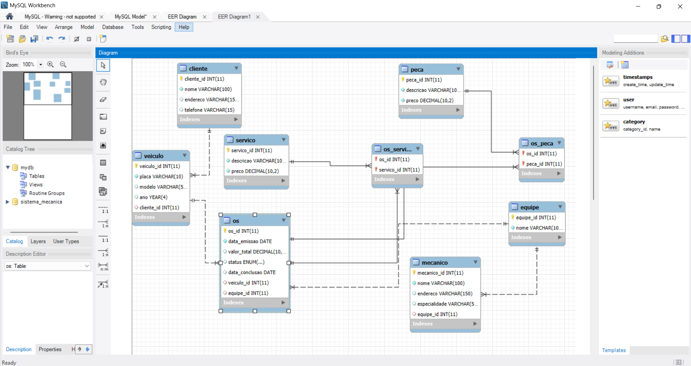

# Sistema de Oficina Mecânica - Modelo Conceitual

## Descrição do Projeto
Este projeto foi desenvolvido para criar um esquema conceitual de um sistema de gerenciamento de ordens de serviço em uma oficina mecânica. O objetivo é permitir o controle de clientes, veículos, ordens de serviço, equipes de mecânicos, serviços e peças, facilitando o gerenciamento dos processos e organização da oficina.

O sistema permite:
- Registro e consulta de clientes e seus veículos.
- Controle das ordens de serviço com atribuição de equipes, serviços realizados e peças utilizadas.
- Gestão de equipes e mecânicos especializados que atuam nas ordens de serviço.

Este modelo foi criado com base em um cenário proposto e organizado de acordo com o contexto de uma oficina mecânica.

## Modelo ER - Entidades e Relacionamentos

O modelo ER (Entidade-Relacionamento) para o sistema é estruturado da seguinte forma:

### Entidades

- **Cliente**
  - **Atributos**: `cliente_id` (PK), `nome`, `endereco`, `telefone`
  
- **Veículo**
  - **Atributos**: `veiculo_id` (PK), `placa`, `modelo`, `ano`, `cliente_id` (FK)
  - **Relacionamento**: Cada veículo pertence a um cliente.
  
- **Ordem de Serviço (OS)**
  - **Atributos**: `os_id` (PK), `data_emissao`, `valor_total`, `status`, `data_conclusao`, `veiculo_id` (FK), `equipe_id` (FK)
  - **Relacionamentos**: Cada OS é vinculada a um veículo e atribuída a uma equipe.

- **Equipe**
  - **Atributos**: `equipe_id` (PK), `nome`
  - **Relacionamento**: Uma equipe é atribuída a uma ou mais OS e pode ter vários mecânicos.

- **Mecânico**
  - **Atributos**: `mecanico_id` (PK), `nome`, `endereco`, `especialidade`, `equipe_id` (FK)
  - **Relacionamento**: Cada mecânico pertence a uma equipe.

- **Serviço**
  - **Atributos**: `servico_id` (PK), `descricao`, `preco`

- **Peça**
  - **Atributos**: `peca_id` (PK), `descricao`, `preco`

### Relacionamentos

- **Cliente - Veículo**: Um cliente pode ter vários veículos, mas cada veículo pertence a um único cliente.
- **Veículo - OS**: Um veículo pode ter várias ordens de serviço (OS), mas cada OS está vinculada a um único veículo.
- **Equipe - OS**: Cada OS é designada para uma equipe.
- **Equipe - Mecânico**: Cada mecânico faz parte de uma equipe, e uma equipe pode ter vários mecânicos.
- **OS - Serviço**: Um serviço pode ser incluído em várias OSs e cada OS pode conter vários serviços (representado pela tabela associativa `OS_Servico`).
- **OS - Peça**: Uma peça pode ser incluída em várias OSs e cada OS pode conter várias peças (representado pela tabela associativa `OS_Peca`).

## Exemplo de Diagrama ER

_Para visualizar o diagrama ER do modelo conceitual, confira a imagem abaixo:_



## Estrutura das Tabelas no Banco de Dados

As tabelas foram implementadas em MySQL e seguem a estrutura do modelo conceitual. O código SQL utilizado para criação das tabelas está incluído no arquivo `database.sql`.

## Instruções para Configuração e Uso

1. Clone o repositório para seu ambiente local:
    ```bash
    git clone https://github.com/seu-usuario/sistema-oficina-mecanica.git
    ```

2. Acesse o diretório do projeto:
    ```bash
    cd sistema-oficina-mecanica
    ```

3. Importe o arquivo `database.sql` no seu ambiente MySQL para criar o banco de dados e as tabelas.

4. Teste a estrutura inserindo dados de exemplo nas tabelas. O modelo foi projetado para garantir integridade referencial e facilitar consultas sobre clientes, veículos, ordens de serviço, equipes, mecânicos, serviços e peças.

## Notas Adicionais

- Este modelo foi baseado em um cenário hipotético de uma oficina mecânica. Caso haja requisitos específicos não abordados na narrativa, ajuste as tabelas e relacionamentos conforme necessário.
- Utilize o arquivo `README.md` para documentar quaisquer mudanças futuras no modelo e para registrar as regras de negócio adicionais aplicadas ao sistema.

---

Este projeto é parte do meu portfólio de desenvolvimento e modelagem de bancos de dados relacionais. Fique à vontade para fazer sugestões ou perguntas!

---

## Autor

Desenvolvido por [Mirka Juliet](https://github.com/MirkaJuliet34) - Engenheira de Software especializada em modelagem e desenvolvimento de sistemas.

